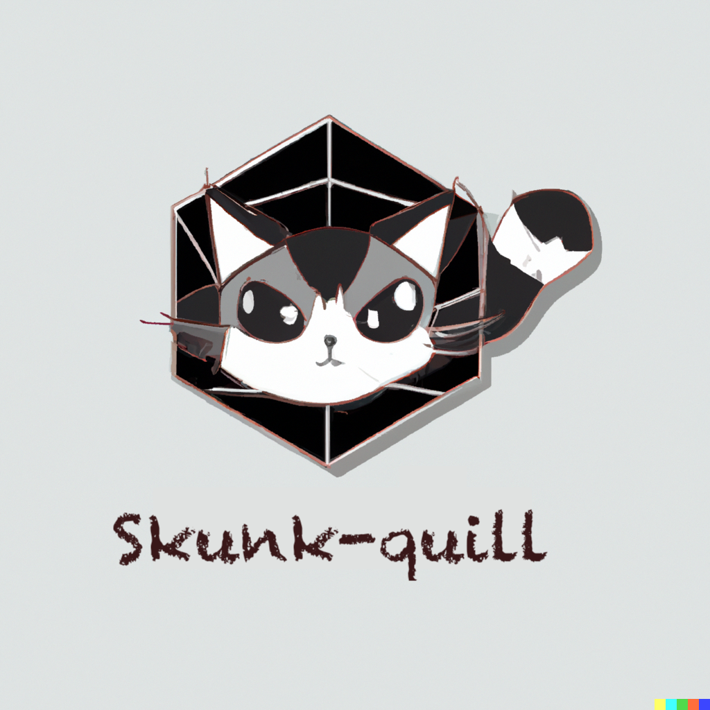

# Skunk-quill for Scala 2.13
[](https://github.com/ivanmoreau/skunk-quill.scala/actions/workflows/test.yml)
[](https://jitpack.io/#com.ivmoreau/skunk-quill.scala)
[](https://opensource.org/licenses/MPL-2.0)



WARNING: This library is a proof of concept made in a day.

This library provides a [Skunk](https://typelevel.org/skunk/) connector for [Quill](https://getquill.io/).
It allows you to write your queries with the be1autiful Quill DSL and execute them with the brilliant Skunk.

## Why?

Quill is cool. But then I discovered Skunk by reading its documentation, and I really really liked it
(have you seen its error messages?). So Skunk is cool too. But what if we could use the magic of Quill
DSL with the power of Skunk? That's what this library is about, about power, magic, hegemony,
world domination, and socioeconomics (ok, maybe not the last one). But mostly about power and magic.
You get the idea, right? right?! But to be honest, I made this as an exercise and proof of concept
in a day (16/07/2023).

## Considerations

Soooo, there is this thing about Skunk and Quill. Skunk does its own type encoding/decoding, and
Quill does its own type encoding/decoding. So, this library kind of avoids the problem by using
`List[Any]` as the type for the Decoder of Skunk side, which represent the row of the result set.
This value is then passed to Quill, which will properly decode with its own type decoder. The encoder
is less tricky, as it is just handled by Quill, so when we get the final SQL query, we just pass it
to Skunk as the SQL string (avoiding the need to encode the values). And that's it. It works. I don't
have any `but` to add here because its the best way I could find to make it work in a few hours.
But if you have any suggestion, please open an issue or a PR!

## Installation

You need the following resolvers:

```scala
// build.sbt
resolvers += "jitpack" at "https://jitpack.io"

// or build.sc
import coursier.maven.MavenRepository
def repositoriesTask = T.task { super.repositoriesTask() ++ Seq(
    MavenRepository("jitpack").at("https://jitpack.io")
  )
}
```

Then add the following dependency (this library is published on Jitpack only for Scala 2.13!):

```scala
// build.sbt
libraryDependencies += "com.ivmoreau" % "skunk-quill.scala" % "<version>"

// or build.sc
ivy"com.ivmoreau:skunk-quill.scala:<version>"
```

See the badge above for the latest version. A commit hash can also be used as a version.
Or use a version from Releases.

## Usage

It mostly works like any other Quill connector, except that you need to provide a Skunk `Session`
in the `SkunkContext` constructor. The creation of the `Session` is up to you, and you can use
the official Skunk documentation for that purpose
(see [here](https://typelevel.org/skunk/reference/Sessions.html)). For Quill, see
[here](https://web.archive.org/web/20230526004744/https://getquill.io/#docs).

```scala
import cats.effect.{IO, Resource, IOApp}
import cats.effect.std.Console
import skunk.Session
import com.ivmoreau.skunkquill.SkunkContext
import io.getquill.SnakeCase
import natchez.Trace.Implicits.noop

object Main extends IOApp.Simple {
  val sessionResource: Resource[IO, Session[IO]] =
    Session.single(
      host = "localhost",
      port = 5432,
      user = "user",
      database = "somedb",
      password = Some("somepw")
    )

  val db = sessionResource.map(new SkunkContext[SnakeCase](SnakeCase, _))
  
  val run = db.use { ctx =>
    import ctx.*

    val q = quote {
      query[Person].filter(p => p.name == "John")
    }

    ctx.run(q).flatMap { people =>
      Console[IO].println(s"Found ${people.size} people: ${people.mkString(", ")}")
    }
  }
}
```

## License

This project is licensed under the Mozilla Public License 2.0 - see the [LICENSE](LICENSE). For
Quill derived code, see the [Apache License 2.0](https://github.com/zio/zio-quill/blob/master/LICENSE.txt).
All new code is explicitly licensed under the MPL 2.0.

## Acknowledgments

* [Skunk](https://typelevel.org/skunk/)
* [Quill](https://getquill.io/)

## Contributing

Follow the [Scala Code of Conduct](https://www.scala-lang.org/conduct/), and license your work
under the [MPL 2.0](LICENSE). Contributions are always welcome, from documentation to testing to
code changes. You don't need to open an issue first, but it might be a good idea to discuss your
plans in case others (or I) are already working on it.