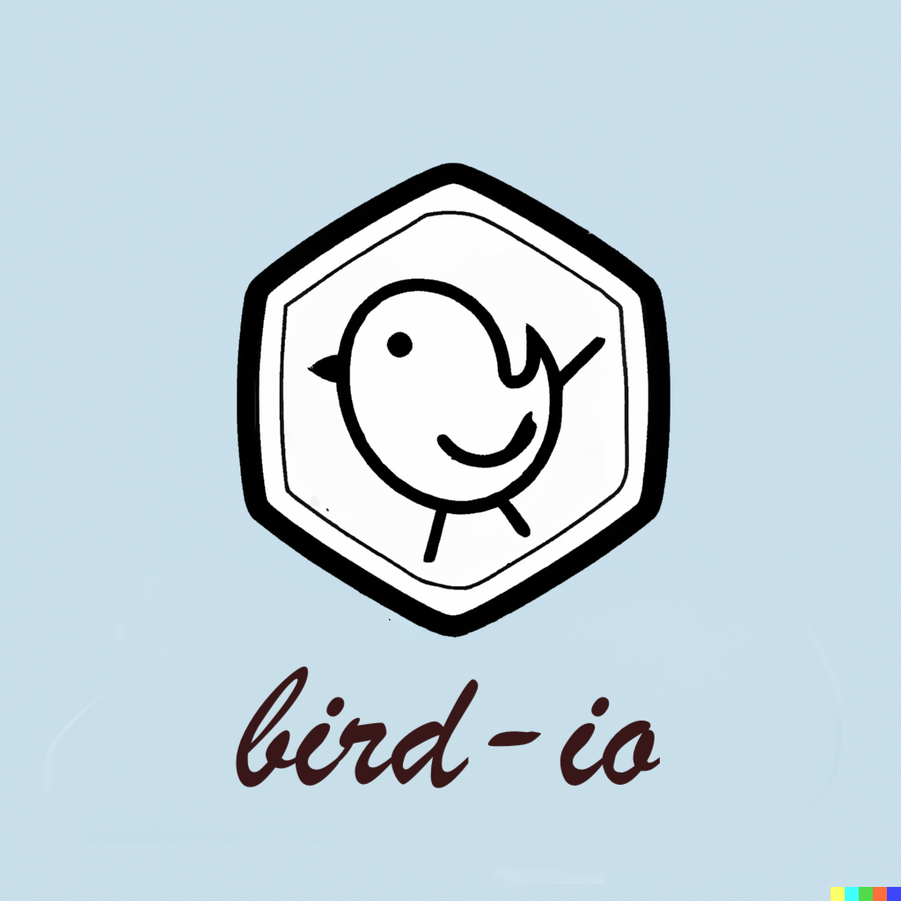

# BirdIO - A Twitter Futures Wrapper with Cats Effect ʕ•ᴥ•ʔ
[](https://github.com/ivanmoreau/birdio/actions/workflows/ci.yml)
[](https://opensource.org/licenses/MPL-2.0)



WARNING: This library is WIP.

# Overview
BirdIO is a super cute wrapper around Twitter Futures that aims to provide a similar interface to the cats.effect.IO data type, enabling functional programming with asynchronous operations! ฅ^•ﻌ•^ฅ This library allows you to work with asynchronous computations in a monadic style, making it easy to compose and chain operations like magic~

# Installation
To use BirdIO, add the following dependency to your project:

```scala
libraryDependencies += "com.ivmoreau" %% "birdio" % "<tag | version>"
```

# Usage
## Creating BirdIO Instances
BirdIO instances can be created using various adorable methods:

1. Delayed Evaluation
```scala
import com.ivmoreau.birdio.BirdIO

val delayedComputation: BirdIO[Int] = BirdIO.delay {
  // Your computation here
  42
}
```

2. Pure Value
```scala
val pureValue: BirdIO[String] = BirdIO.pure("Hello, world!")

```

3. Asynchronous Computation with Twitter Futures

```scala
import com.twitter.util.Future

val twitterFuture: Future[Int] = Future {
  // Your asynchronous computation here
  100
}

val birdIOFromTwitterFuture: BirdIO[Int] = BirdIO.unsafeFromXFuture(twitterFuture)
```

## Chaining Operations
BirdIO supports typical monadic operations like map, flatMap, flatten, and others! Let's dance~ ٩(◕‿◕｡)۶

```scala
val result: BirdIO[Int] = for {
  a <- BirdIO.pure(10)
  b <- BirdIO.pure(20)
  c <- BirdIO.delay(a + b)
} yield c
```

## Error Handling
BirdIO provides error handling capabilities using handleError and handleErrorWith! Don't worry, we gotchu (つ✧ω✧)つ

```scala
val computation: BirdIO[Int] = BirdIO.delay {
  // Some computation that might throw an exception
  42
}

val handled: BirdIO[Int] = computation.handleError { error =>
  // Handle the error and provide a fallback value
  println(s"An error occurred: $error")
  0
}
```

## Asynchronous Operations
BirdIO allows you to work with asynchronous operations using async and deferred! Let's fly together (•̀ᴗ•́)و ̑̑

```scala
val asyncComputation: BirdIO[Int] = BirdIO.async { callback =>
  // Your asynchronous computation here
  // Call the callback with the result when done
  callback(Right(42))
}

val deferredValue: BirdIO[Int] = BirdIO.defer(BirdIO.delay {
  // Your deferred computation here
  100
})

```
## Utilities
BirdIO comes with some utility methods to work with Ref, Deferred, and more! So helpful! (•ω•)∩╮

```scala
val refValue: BirdIO[Ref[BirdIO, Int]] = BirdIO.ref(10)

val deferredValue: BirdIO[Deferred[BirdIO, String]] = BirdIO.deferred

val uniqueToken: BirdIO[Unique.Token] = BirdIO.unique

```

# License
BirdIO is licensed under MPL2. See the LICENSE file for more details. (◕‿◕✿)

## Contributing

Follow the [Scala Code of Conduct](https://www.scala-lang.org/conduct/), and license your work
under the [MPL 2.0](LICENSE). Contributions are always welcome, from documentation to testing to
code changes. You don't need to open an issue first, but it might be a good idea to discuss your
plans in case others (or I) are already working on it.